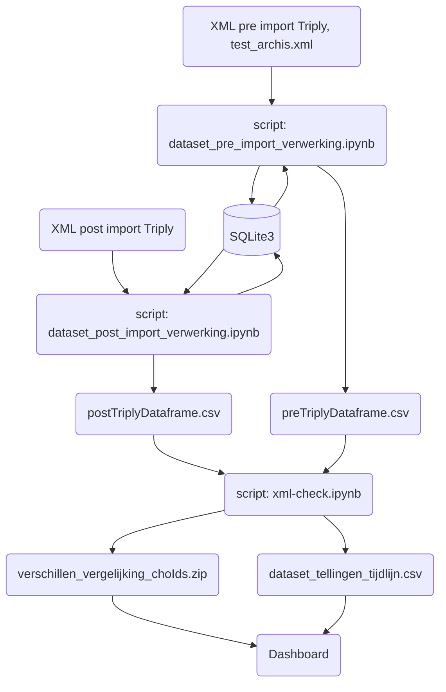

# Datakwaliteit Dashboard: Vergelijking tussen de xml file pre en post import in TriplyDB.

### Zie hier de [Dashboard](https://cultureelerfgoed.github.io/dataquality_import_export_Triply/)

Dit prototype is ontwikkeld om op een interactive manier datakwaliteit in kaart te brengen en vragen vanuit de bussiness te beantwoorden. Er is zowel gekeken naar de benodigheden om een dergelijke vergelijking te kunnen maken.

Voor de vergelijkingcode zie: [XML comparisson](https://nbviewer.org/github/cultureelerfgoed/dataquality_import_export_Triply/blob/main/xml-check.ipynb?flush_cache=true)

Voor de code voor data verwerking zie: 
- [XML verwerking Pre-Triply import](https://nbviewer.org/github/cultureelerfgoed/dataquality_import_export_Triply/blob/main/dataset_pre_import_verwerking.ipynb?flush_cache=true)
- [XML verwerking Post-Triply import](https://nbviewer.org/github/cultureelerfgoed/dataquality_import_export_Triply/blob/main/dataset_post_import_verwerking.ipynb?flush_cache=true)

Hieronder de dataflow schema dat weergeeft hoe data verwerkt is in dit pipeline:

